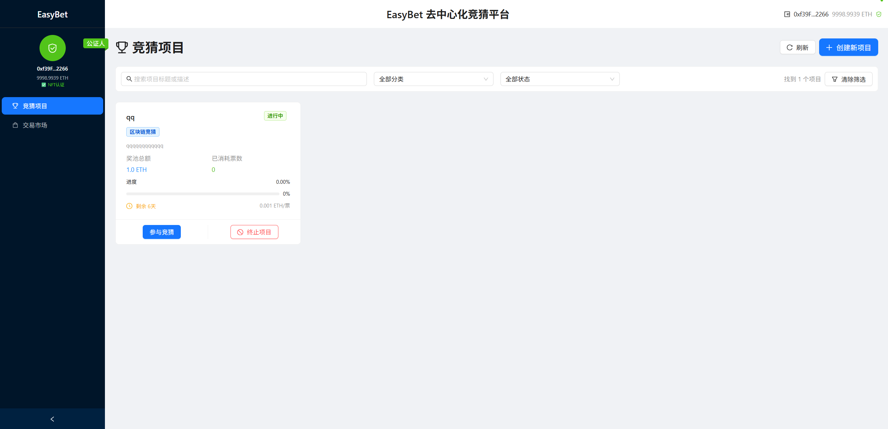
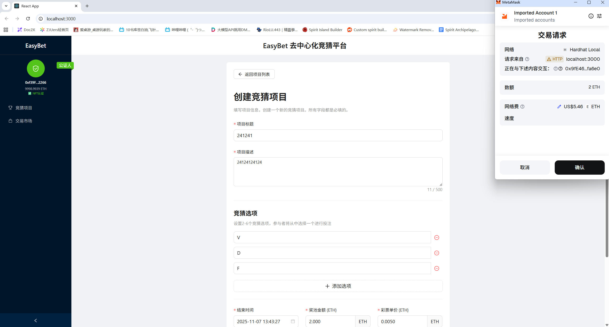
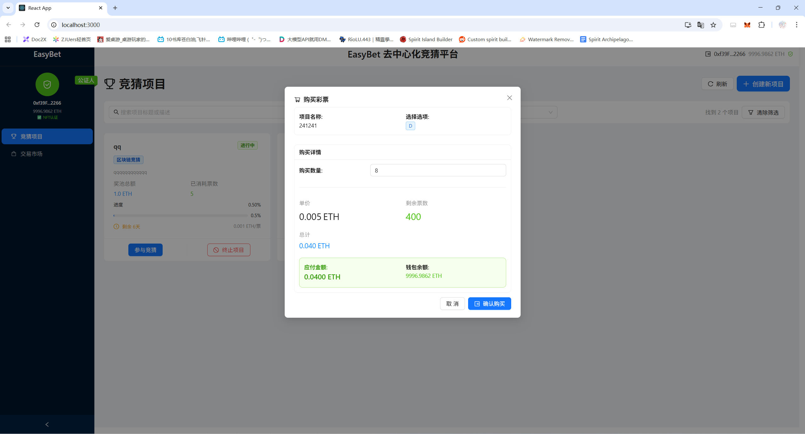
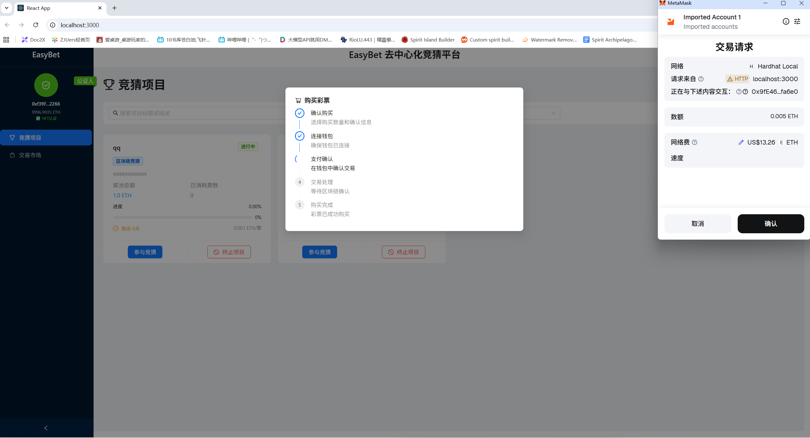
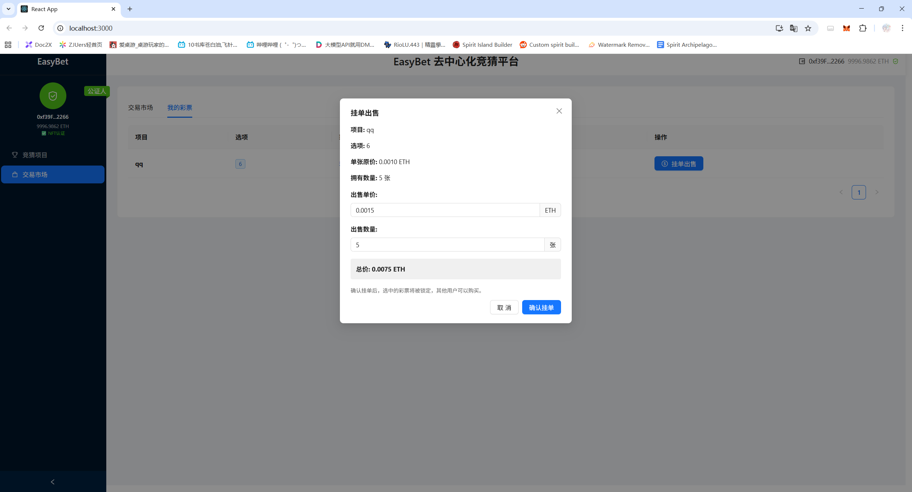
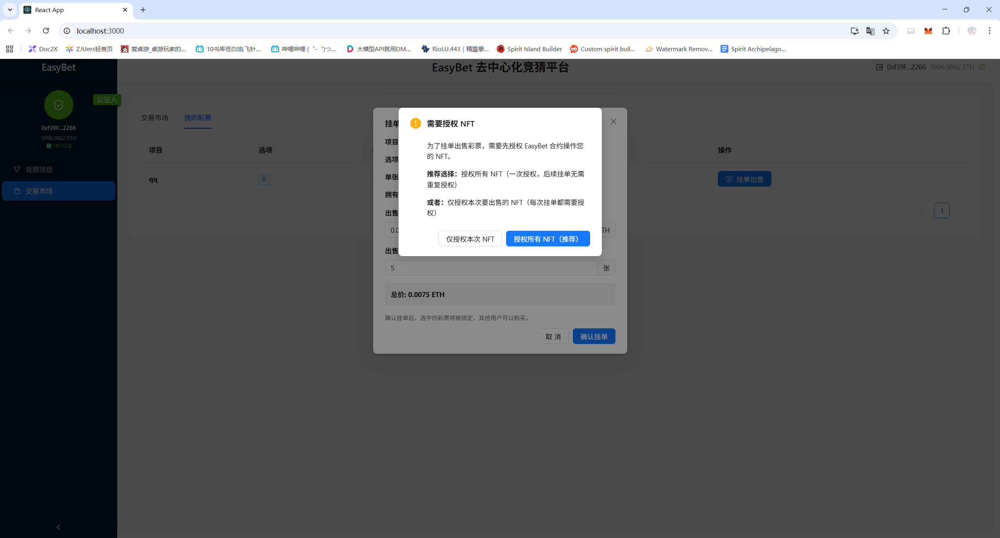
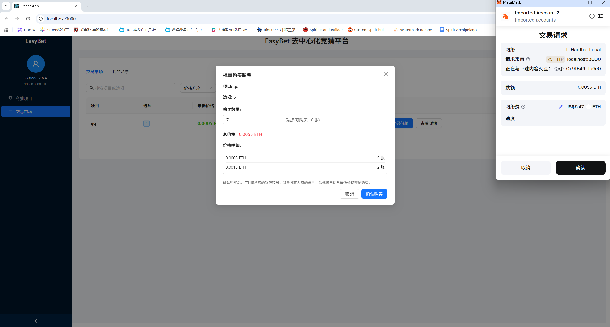
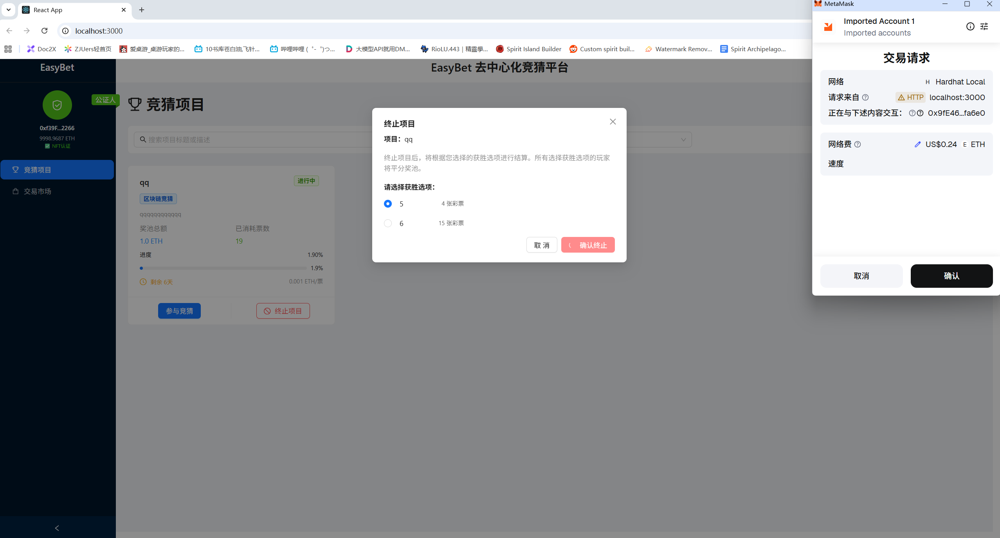

# EasyBet 去中心化竞猜平台

## 如何运行

### 环境要求

- Node.js (版本 >= 16.0.0)
- npm 或 yarn
- MetaMask 浏览器插件

### 1. 安装依赖

#### 安装合约依赖
```bash
cd contracts
npm install
```

#### 安装前端依赖
```bash
cd ../frontend
npm install
```

### 2. 启动本地区块链网络

在 `contracts` 目录下启动 Hardhat 本地网络：

```bash
cd contracts
npx hardhat node
```

保持此终端运行，你会看到类似以下输出：
```
Started HTTP and WebSocket JSON-RPC server at http://127.0.0.1:8545/
```

### 3. 部署智能合约

打开新的终端窗口，在 `contracts` 目录下部署合约：

```bash
cd contracts
npx hardhat run scripts/deploy.ts --network localhost
```

部署成功后，记录输出的合约地址，类似：
```
EasyBet deployed to: 0x5FbDB2315678afecb367f032d93F642f64180aa3
NotaryNFT deployed to: 0xe7f1725E7734CE288F8367e1Bb143E90bb3F0512
TicketNFT deployed to: 0x9fE46736679d2D9a65F0992F2272dE9f3c7fa6e0
```

### 4. 配置前端环境

在 `frontend` 目录下创建 `.env` 文件（如果不存在）：

```bash
cd frontend
cp .env.example .env
```

编辑 `.env` 文件，填入部署的合约地址：
```
REACT_APP_EASYBET_ADDRESS=0x5FbDB2315678afecb367f032d93F642f64180aa3
REACT_APP_NOTARY_NFT_ADDRESS=0xe7f1725E7734CE288F8367e1Bb143E90bb3F0512
REACT_APP_TICKET_NFT_ADDRESS=0x9fE46736679d2D9a65F0992F2272dE9f3c7fa6e0
REACT_APP_NETWORK_ID=31337
```

### 5. 配置 MetaMask

1. 打开 MetaMask，点击网络下拉菜单
2. 选择"添加网络"或"自定义RPC"
3. 填入以下信息：
   - 网络名称: `Hardhat Local`
   - RPC URL: `http://127.0.0.1:8545`
   - 链ID: `31337`
   - 货币符号: `ETH`

4. 导入测试账户：
   - 复制 Hardhat 输出的私钥（Account #0, #1 等）
   - 在 MetaMask 中导入账户

### 6. 启动前端应用

在 `frontend` 目录下启动开发服务器：

```bash
cd frontend
npm start
```

应用将在 `http://localhost:3000` 启动。

### 7. 开始使用

1. **连接钱包**：在浏览器中访问 `http://localhost:3000`，点击连接 MetaMask
2. **获取公证人权限**：使用 Account #0（部署者账户）可以铸造公证人 NFT
3. **创建竞猜项目**：拥有公证人 NFT 的账户可以创建竞猜项目
4. **购买彩票**：其他账户可以购买彩票参与竞猜
5. **终止项目**：公证人可以终止项目并分发奖励

## 功能实现分析

本项目实现了一个完整的去中心化竞猜平台，包含以下核心功能：

### 1. 购买彩票
- **功能描述**: 用户可以选择项目和选项，购买对应的彩票NFT
- **实现方式**: 
  - **前端流程**: 用户在`ProjectsPage.tsx`中点击"参与竞猜"按钮，触发`handlePurchaseTicket`函数打开`PurchaseModal.tsx`购买弹窗。用户选择选项和数量后，前端通过`ethers.utils.parseEther`计算总价格，调用`contract.ts`中的`purchaseTicket`或`purchaseMultipleTickets`函数
  - **合约交互**: 前端创建Web3Provider连接MetaMask，获取signer签名者，实例化EasyBet合约。调用合约的`purchaseTicket(projectId, optionIndex, betAmount)`函数，传入项目ID、选项索引和投注金额
  - **合约执行**: 合约验证项目状态、投注金额、彩票价格等条件，计算彩票ID和元数据URI，调用TicketNFT合约的`mint`函数铸造ERC721 NFT彩票，更新项目的投注统计(`bets`映射)和已售票数(`soldTickets`)，触发`BetPlaced`和`TicketPurchased`事件
  - **数据存储**: 彩票信息存储在TicketNFT合约中，包含项目ID、选项索引、投注金额等元数据，投注记录存储在EasyBet合约的`bets[projectId][optionIndex]`映射中

### 2. 挂单出售彩票
- **功能描述**: 彩票持有者可以将自己的彩票挂单到市场上出售
- **实现方式**:
  - **前端流程**: 用户在`MarketPage.tsx`的"我的彩票"标签页中选择要出售的彩票，点击"出售"按钮打开出售弹窗。用户设置出售价格和数量，前端调用`confirmSell`函数处理出售逻辑
  - **授权验证**: 前端首先检查彩票所有权，验证彩票是否已被挂单。对于单张彩票调用`ticketNFTContract.approve(EASYBET_CONTRACT_ADDRESS, ticketId)`进行授权，批量出售则调用`setApprovalForAll`
  - **合约交互**: 前端调用`contract.ts`中的`listTicketForSale`或`listMultipleTicketsForSale`函数，将价格转换为wei单位，调用EasyBet合约相应函数
  - **合约执行**: 合约验证彩票所有权、授权状态，将彩票NFT从用户地址转移到合约地址进行托管，创建`TicketListing`结构体存储挂单信息(listingId、projectId、ticketId、seller、price等)，更新`listings`映射和`activeListings`数组，触发`MarketplaceAction`事件
  - **数据管理**: 挂单信息存储在合约的`listings`映射中，活跃挂单ID存储在`activeListings`数组中，支持按项目ID查询挂单

### 3. 购买挂单彩票
- **功能描述**: 用户可以从市场上购买其他人挂单出售的彩票
- **实现方式**:
  - **前端流程**: 用户在`MarketPage.tsx`的"市场"标签页浏览挂单，点击"购买"按钮选择购买数量。前端调用`calculateBulkPrice`函数计算批量购买的总价格和价格分解，显示价格明细后用户确认购买
  - **价格计算**: 前端调用`calculateBulkPurchasePrice`函数，获取项目所有活跃挂单，按价格从低到高排序，计算购买指定数量彩票的最优价格组合，返回总价格和价格分解详情
  - **合约交互**: 前端调用`buyMultipleListedTickets`函数，传入项目ID、选项索引、购买数量，合约自动选择最低价格的挂单进行购买
  - **合约执行**: 合约调用`_getSortedListingsByPrice`函数获取按价格排序的挂单列表，验证购买者余额充足，按价格从低到高依次购买挂单彩票。对每个挂单，将彩票NFT从合约转移给购买者，将支付金额转给卖家，从活跃挂单中移除已售挂单，触发`MarketplaceAction`事件
  - **资金流转**: 购买者支付的ETH直接转给对应的卖家，合约不收取手续费，确保点对点交易的去中心化特性

### 4. 结算投注项目
- **功能描述**: 公证人可以终止项目并根据结果分配奖池给获胜者
- **实现方式**:
  - **前端流程**: 公证人在`ProjectsPage.tsx`中看到"终止项目"按钮(仅公证人可见)，点击后打开终止弹窗选择获胜选项。前端调用`confirmTerminateProject`函数，调用`contract.ts`中的`terminateProject`函数
  - **两阶段执行**: 前端分两步执行结算：第一步调用合约的`terminateProject(projectId, winningOption)`设置获胜选项并标记项目为已结算；第二步调用`getWinningTickets`获取获胜彩票列表，然后调用`distributeRewardsToTickets(projectId, winningTicketIds)`分配奖金
  - **合约执行**: `terminateProject`函数验证调用者为公证人，检查项目状态，设置`projects[projectId].isFinalized = true`和`winningOption`，触发`ProjectFinalized`事件。`distributeRewardsToTickets`函数计算每张获胜彩票的奖金份额(总奖池/获胜彩票数)，遍历获胜彩票ID列表，向每个彩票持有者转账相应奖金
  - **奖金分配**: 如果没有获胜彩票，奖池退还给项目创建者；如果有获胜彩票，奖池平均分配给所有获胜彩票持有者，确保公平分配
  - **状态更新**: 项目状态从"active"变为"settled"，前端重新加载项目数据显示最新状态

### 5. [BONUS]链上订单簿
- **功能描述**: 提供去中心化的彩票交易市场，支持按价格排序的订单管理
- **实现方式**:
  - **前端聚合**: `MarketPage.tsx`调用`fetchMarketOrders`函数获取市场数据，调用合约的`getActiveListings`获取所有活跃挂单，按项目ID和选项索引聚合挂单数据，构建`MarketOrder`结构包含项目信息、最低价格、总数量和价格分布
  - **价格排序**: 前端将同一项目同一选项的挂单按价格分组，构建`priceDistribution`数组包含每个价格档位的数量和挂单ID列表，按价格从低到高排序显示
  - **合约查询**: 合约提供多个查询函数：`getActiveListings()`返回所有活跃挂单ID数组，`getProjectListings(projectId)`返回特定项目的挂单，`getListingDetails(listingId)`返回挂单详细信息，`getUserListings(userAddress)`返回用户的挂单
  - **数据结构**: 合约使用`listings`映射存储挂单详情，`activeListings`数组维护活跃挂单ID列表，`projectListings`映射按项目ID索引挂单，支持高效的多维度查询
  - **实时更新**: 每次挂单创建、购买或取消时，合约自动更新相关数据结构，前端监听`MarketplaceAction`事件实时刷新订单簿数据，确保数据一致性
  - **批量操作**: 支持批量购买功能，合约的`_getSortedListingsByPrice`函数返回按价格排序的挂单，自动选择最优价格组合，前端显示价格分解明细，提供透明的批量交易体验

## 项目运行截图

















## 参考内容

- 课程的参考Demo见：[DEMOs](https://github.com/LBruyne/blockchain-course-demos)。

- 快速实现 ERC721 和 ERC20：[模版](https://wizard.openzeppelin.com/#erc20)。记得安装相关依赖 ``"@openzeppelin/contracts": "^5.0.0"``。

- 如何实现ETH和ERC20的兑换？ [参考讲解](https://www.wtf.academy/en/docs/solidity-103/DEX/)

如果有其它参考的内容，也请在这里陈列。
